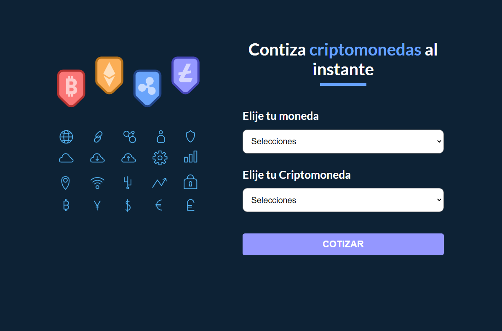
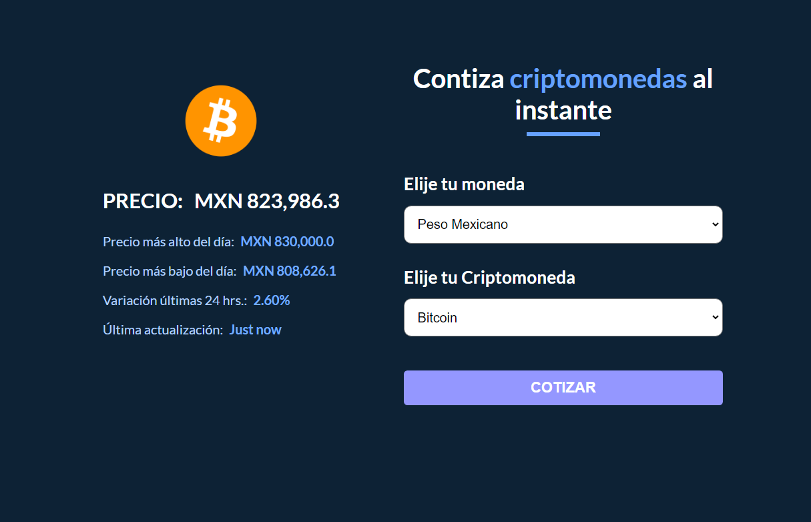

# Cotizador de Criptos

## Aplicación desarrollada con React - Hooks que permite realizar una cotización de criptomonedas a la moneda locar elegida

&nbsp;        
&nbsp;   

API:
~~~ 
https://min-api.cryptocompare.com 
~~~
&nbsp;

Preview 👇    
&nbsp;      

&nbsp;     
&nbsp;  
 

